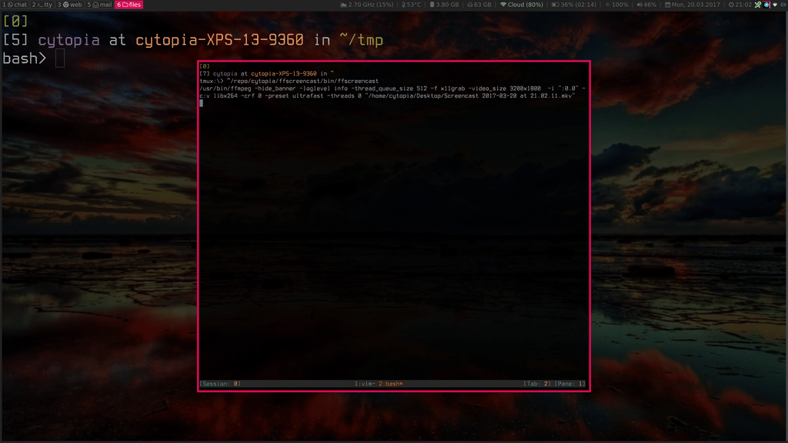

ls with labels
==============

> POC: Colorful file labels for you terminal which are displayed in `ls` output.

**Abstract**  
Modern graphical file manager offer the ability to label or tag certain files
or directories with the primary goal for simpler searches based on them.

I personally work-cli only (least as much as possible) and therefore lacking
that feature. So I came up with something that I wanted to share here:

Meet `lsl` - a proof of concept tool which tries to make labels work with your
favorite file listing tool. With it you can have labels shown in normal`ls`
output. The core is nothing more than a simple wrapper around the ls command
mixed with some search and replace magic behind the scenes.


**Demonstration**



---

**Note**  
This is a proof-of-concept and still a work-in-progress project. Please do test it and submit any bugs you find. If you like this project and want it to continue, let me know by staring it.

---

Installation
------------
```shell
$ ./configure [--prefix=/usr/local]
$ make
$ sudo make install
```


Quickstart
----------

Create two labels
```shell
$ lbl admin -a important
$ lbl admin -a todo
```

Assign labels to files
```shell
$ lbl add important ~/tmp/rsync.txt
$ lbl add todo ~/tmp/how-to-ec2.md
```

Show folder contents with `lsl.py` or `lsl.sh`
<pre>
$ lsl.py -l ~/tmp
total 254084
-rw-rw-r--  1 cytopia cytopia 260046848 Feb 26 16:26 debian-8.7.1-amd64-netinst.iso
-rwxrwxr-x  1 cytopia cytopia      1813 Mar 18 21:20 how-to-ec2.md <span style="color:white; background-color:#0000ff;">[ todo ]</span>
-rw-rw-r--  4 cytopia cytopia      4096 Mar 13 21:30 rsync.txt <span style="color:white; background-color:#ff0000;">[ important ]</span>
-rw-rw-r--  1 cytopia cytopia         0 Mar 18 15:10 some thing with space
</pre>
Show folder contents with `ls`
```shell
$ ls -l ~/tmp
total 254084
-rw-rw-r--  1 cytopia cytopia 260046848 Feb 26 16:26 debian-8.7.1-amd64-netinst.iso
-rwxrwxr-x  1 cytopia cytopia      1813 Mar 18 21:20 how-to-ec2.md
-rw-rw-r--  4 cytopia cytopia      4096 Mar 13 21:30 rsync.txt
-rw-rw-r--  1 cytopia cytopia         0 Mar 18 15:10 some thing with space
```


Available Files
---------------

Binaries
* `lsl.sh`: Bash wrapper for `ls` to show labels
* `lsl.py`: Python wrapper for `ls` to show labels
* `lbl`: Label manager (add, edit, remove, list, search and admin tasks)

Database files
* `label.lbl`: Text file defines the labels and their colors
* `store.lbl`: Text file which holds the relation between files and labels

Bash completion
* `lbl`:  Bash/ZSH completion for the Label manager

If you don't have python installed, use the bash wrapper. However the bash version is notably slower (>10x) when showing folders with lots of files. So I recommend you stick to the python version.


Usage: ls
---------

You can Use it exactly as you can with ls. (see [man ls](https://linux.die.net/man/1/ls)):
```shell
$ lsl.py -al
$ lsl.py --color=always /usr/bin -l -a
$ lsl.py -l -a ~/Desktop
$ lsl.py ~/.config --color=always --group-directories-first -al
```

For your convenience, I suggest creating a bash/zsh alias. A few examples:
```shell
# Add this to you bash/zsh config file:
alias lsl='lsl.py -l'

# You can also add your favorite ls arguments
alias lsl='lsl.py -l --color=always --group-directories-first'
```


Usage: Managing labels (`lbl`)
------------------------------

**[Label Manager Usage](doc/LABEL_MANAGER.md)**

In order to be able to have labels appear next to files listed with `lsl.py`
or `lsl.sh` you will first have to do two things.

1. Define labels (text and color)
2. Assign available labels to files or directories.

The first one is a task you do not have to do very often, simply define your
labels as you would do on github.com for example. This is done via the label
manager admin commands (`lbl admin`).

Now that you have available defined labels you can easily assign them to files
and directories via the label manager. The label manager includes many subcommands
with which you can do various actions including, adding, editing, deleting and
searching.

Searching is also a very extensive feature. You can search by various criterias
such as: by name, by regex, by path and by created and modified date.

See **[Label Manager Usage](doc/LABEL_MANAGER.md)** for complete set of commands.


Bash/ZSH completion
-------------------

If you are as lazy as I am, you probably do not always want to type the full commands, but rather tab-complete for quicker results.

The label manager comes with bash completion for all its arguments, just as you are used from git for example.


Technical info
--------------

In case you wonder how this all works, here are some basic information.
If it might still be unclear let me know and I will expand this section.

### Label definitions
Label names and their colors are stored in `~/.config/lsl/label.lbl` in plain
text in the following format:
```
LABEL:::::COLOR
```
This file holds all your label definitions that can be assigned to files or
directories via the label manager.


### Label database
Label assignments are stored in `~/.config/lsl/store.lbl` in plain text in the
following format:
```
PATH:::::LABEL:::::COLOR:::::CREATED:::::MODIFIED
```
Plain text is chosen so that it is easy for others to write their own script
and be able to parse this file as needed. As well as to make it easier to
apply regex searches against this file.

Plaintext makes it also possible to quickly search and replace some parts
if you want to work manually on that file.

### ls wrapper

`lsl.py` and `lsl.sh` are just wrapper scripts around the actual `ls` command.
All they do is

* issue the ls commaND supplied by the user
* Extract the files from the output
* Compare the files against the label database and add labels on match to the output

That's it, nothing magical.


### Label manager

The label manager is a simple shell script that will edit `~/.config/lbl/store.lbl`
for you. You could also edit that file manually.

The label manager's task can be split into 4 major subtasks
* Create global useable labels
* Attach/remove labels on files and directories
* Search labelled files by various criterias
* Fix label database


Frequently Asked Questions
--------------------------

**Where are my ls colors?**

In order to get your ls colors back, you will need to parse `--color=always` to `lsl.py` or `lsl.sh`.
`--color=auto` does not work within scripts, so it must be forced.

Current issues
--------------

This software is far away from stable with a couple of known bugs that are being worked on. Some of them are:


### Intended bevior
* Labels will **only be shown in long output** (`-l`)

### Actual bugs
* Labels won't be shown for directories when using `--classify`|`-F`
* Labels won't be shown for directories when using `--indicator-style`|`-p`
* Labels won't be shown when using `--inode`|`-o`
* Labels won't be shown when using `-g`
* Labels won't be shown when using `--no-group`|`-G`
* Labels won't be shown when using `-o`
* Labels won't be shown when using `-Q`
* Labels won't be shown when using `-x`
* Labels won't be shown on symlinks when output is like: `file -> realfile`


Brainstorm ideas
----------------

There is a whole page for **[Ideas](doc/IDEAS.md)**


License
-------
Lsl is released under the terms of the MIT license. See [LICENSE](LICENSE.md) for more
information or see https://opensource.org/licenses/MIT.


Contribute
----------

This is an open-source project I do in my spare time which is absolutely free to use for anybody. If this tool makes your life easier consider contributing to it.

There are a couple of things how you can contribute:

1. Let me know you like it by pressing the star button. Everyone is honored by *likes*. Seeing a good amount of people interested in this project, I can put in my effort accordingly.
2. Try it out, play with it and if it is useful stick with it. Consider yourself a tester and please do report any bugs you encounter, so they can be put onto the roadmap. 
3. You have an awesome feature in mind that should be integrated, please do report it.
4. You have an awesome feature in mind that should be integrated and you are a programmer, please fork this repository and try to implement it. Github is all about giving code to the community.
5. You know about graphics? Submit a logo.
6. This tool is really making you happy, consider donating a beer:


And btw, if you find a typo, that's a nice thing too to report ;-)

